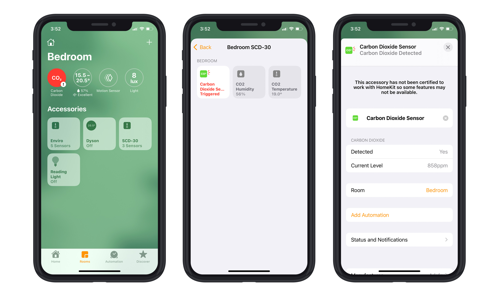

# HomeKit SCD-30 CO2 sensor

An Apple HomeKit accessory for the [Adafruit SCD-30 CO2 sensor](https://www.adafruit.com/product/4867).

## Hardware

* Adafruit SCD-30 CO2 sensor ([Core Electronics](https://core-electronics.com.au/adafruit-scd-30-ndir-co2-temperature-and-humidity-sensor-stemma-qt-qwiic.html))
* Raspberry Pi (3, 4, zero)

### Wiring

Adafruit have a great tutorial: [Learn SCD-30](https://learn.adafruit.com/adafruit-scd30/python-circuitpython)

| Raspberry Pi pin | SCD-30 sensor pin | Wire colour |
| - | - |
| `1` 3.3V | `VIN` Voltage in | Red |
| `3` GPIO 02 I2C SDA | `SDA` I2C SDA | Blue |
| `5` GPIO 03 I2C SCL | `SCL` I2C SCL | Yellow |
| `6` Ground | `GND` Ground | Black |

## Software

* Install [Go](http://golang.org/doc/install) >= 1.14 ([useful Gist](https://gist.github.com/pcgeek86/0206d688e6760fe4504ba405024e887c) for Raspberry Pi)
* Build: `go build homekit-scd30.go`
* Run: `go run homekit-scd30.go`
* In iOS Home app, click Add Accessory -> "More options..." and you should see "SCD-30"

## TODO

- [x] Read the sensor
- [x] Add HomeKit CO2, temperature, humidity accessory
- [ ] Add Prometheus exporter
